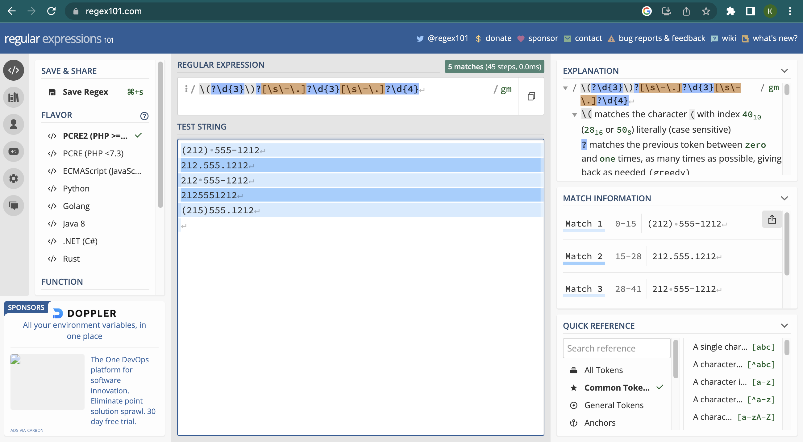

<!--

author:   Joy Payton
email:    paytonk@chop.edu
version:  1.0.0
current_version_description: Initial version
module_type: standard
docs_version: 1.0.0
language: en
narrator: UK English Female
mode: Textbook

title: Regular Expressions

comment:  Learn about regular expressions, or regex, and how to use them in R and Python.

long_description: Regular Expressions, or regex, are ways to specify patterns (such as the pattern that defines a valid email address, medical record number, or credit card number).  Being able to use regex will make it easier for you to find important data.

estimated_time_in_minutes: 60

@pre_reqs
Learners will get the most out of this module if they have beginner-level experience in at least one scripting language (R or Python).  
@end

@learning_objectives  
After completion of this module, learners will be able to:

- define an alphanumeric pattern in regex notation
- test regular expressions in a browser
- use regular expressions to filter data in R and/or Python
@end

import: https://raw.githubusercontent.com/arcus/education_modules/main/_module_templates/macros.md
-->

# Regular Expressions

@overview

## What is a Regular Expression?

The word *regular* (like *regulate*) comes from the Latin root for "rule": *regula*.  A **regular expression** is a specific way to **express** a **rule** for a pattern.  For example, one pattern rule might be for a phone number in the United States.  A phone number in the United States has:

1. A three-digit area code, possibly enclosed by parentheses
2. An optional separator, like a space, dash, or a period
3. A set of three digits
4. An optional separator, like a space, dash, or a period
5. A set of four digits

For example, these are all valid US phone numbers, and you might see them written various ways.

* `(212) 555-1212`
* `212.555.1212`
* `212 555-1212`
* `2125551212`
* `(215)555.1212`

How could you write an expression that expresses the rules we listed above?  This is the regular expression that captures the five rules we enumerated.

`\(?\d{3}\)?[\s\-\.]?\d{3}[\s\-\.]?\d{4}`

Using the pattern above, you could search for and find any phone number (assuming we got the rules right) in your data, without having to scan visually or search for specific area codes.  In this module, you'll learn how to construct regular expressions like the one above and how to use them in code.  For now, here's a sneak preview of what each segment of this regular expression mean:

* `\(?` : Optionally, a single `(` character
* `\d{3}`: Exactly three digits 0-9
* `\)?` : Optionally, a single `)` character
* `[\s\-\.]?`: Optionally, one of the following: a blank space, a dash, or a period.
* `\d{3}`: Exactly three digits 0-9
* `[\s\-\.]?`: Optionally, one of the following: a blank space, a dash, or a period.
* `\d{4}`: Exactly four digits 0-9

## A Great Tool to Start With

Before we explain the details of how to construct regular expressions, it can be helpful to introduce the online regex checker as a great resource to learn and to check your regex before trying to use it in a script.

We like "Regex 101", at https://www.regex101.com, but you can also search online for "regex checker" to find other, similar websites.  Regex 101 allows you to enter your regular expression as well as some sample text that you want to apply the regular expression to.  Below, you can see that we put in our "phone number" regular expression (at the top of the screen, in the appropriately labeled box) as well as the different varieties of phone number we want to make sure match our pattern (pasted in the larger text area below).  Matches are highlighted, and the number of matches is given (in our case, all five varieties of phone number do indeed match our pattern).  

On the right side, there are helpful hints.  At the top, each segment of the regular expression is parsed, or explained.  For example, we read the explanation of our first bit of regex as follows:

> `\(` matches the character `(` with index 4010 (2816 or 508) literally (case sensitive)  
> ? matches the previous token between zero and one times, as many times as possible, giving back as needed (greedy)

What does "index 4010 (2816 or 508)" mean?  It's a description of the encoding of the `(` symbol in different number systems. The decimal code for left parenthesis is 40. This is equivalent to the hexadecimal number 28 and the Octal 50

## Why Use Regex?

There are two very common reasons you might want to use regular expressions (also referred to as regex, which you can pronounce either with "reg" rhyming with "beg" or "reg" rhyming with "wedge").

Reason 1: You're writing code and want to find, or find and replace, something throughout your code that matches a predictable pattern.  For example, maybe you have used hexidecimal color specifications such as #ccc or #FF1451 in your data visualizations, and you want to find all of those, because you want to add comments in your code disclosing the color in English so that your code is more understandable. This goes beyond the typical search you would use in Word or other programs, because you want to find multiple values that start with a hash mark (#) and are followed by three or six digits ranging from 0-9 and A-F (or a-f).

Reason 2: You're analyzing some text values and need to change them or clean them up. For example, in your data, every time you see an identifier that looks like my\_data\_[some numbers]\_[more numbers] you want to extract the first set of numbers, which represents a patient identifier, and the second set of numbers, which represents a sample number, and create new data columns with that information, which will allow you to work with just the patient identifier or just the sample number more easily.

Regular expressions are tricky to learn but if you work with strings (character data) frequently, whether that's from free-text selections in a REDCap database or a problem list from Epic, the learning curve is definitely worth it!

The idea of regular expressions is to describe patterns based in which characters occur, and how many, in what order.  You can also put in a "capturing" element, to capture a specific part of the pattern (in our  example, extracting the patient identifier and/or the sample number).

### Which Characters?

Patterns defined in regex often involve special groups of characters.  For examples, alphabetic characters (a-z and A-Z) are a group, digits (0-9) are another, whitespace characters like tab and space are another group of characters.  Maybe your patient identifiers begin with three letters (a special group), then have a dash (only a single character is valid here), then have four digits (another special group).  You can use predefined groups or define your own.

Here are some common ways to designate which characters form part of a pattern:

* Any single digit (0-9) is represented `\d`  
* Any character at all? That's `.`
* A whitespace character like space or tab? That's `\s`
* Any given letter or number, like the character "u", can be used as-is: `u`
* The upper-case letters only?  You can enclose a range in square brackets: `[A-Z]`
* Any upper or lower case letter? `[A-Za-z]`
* Any digit 0-7, but not other digits? `[0-7]`
* What about excluding letters?  Let's say you have an alphanumeric code that excludes 0 and O (the digit and the capital letter) to reduce confusion.  You can use the caret (`^`)
* Want to use a "special" character (such as square brackets or parentheses or periods) that regex uses to define patterns? You can use a backslash (or several... more on this later) to indicate "literally this character".  For example, `.` means "any character can go here in the pattern" while `\.` means "a literal period should go here in the pattern."
* Want to exclude 

### How Many Characters?

How many characters of the same kind are in a row? Sometimes we know there should be only one of something (for example, just one `@` in an email address).  Sometimes there can be an optional character (like the optional parentheses around the area code of a U.S. phone number).  Sometimes there are a specific number of characters from the same group (like exactly three letters or five numbers).  Maybe there's a range, such as at least 2 letters but not more than 20.  Regular expressions allow you to quantify characters in a pattern as well.

* An optional character, which might not appear at all or might appear once can be represented with a `?` quantifier.  For example, a phone number pattern that might begin with the number 1 or might omit it could begin with `1?`
* An optional character that could also repeat multiple times can be quantified with an asterisk (`*`).  A pattern that 
. At least one, maybe more? That's +. One to three, but not less than one or more than three? That's {1,3}.
Are some characters to be avoided? E.g. you're searching for 1 or more numbers followed by something that's not a letter: \d+[^A-Za-z]
Do some characters need to be saved or pulled out of a string? For example, do I want to pull out just the first number sequence in every phrase that looks like subject_[numbers]_studylocation_[more numbers]?

## Additional Resources

## Feedback

@feedback
